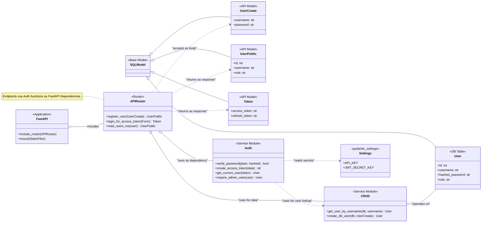
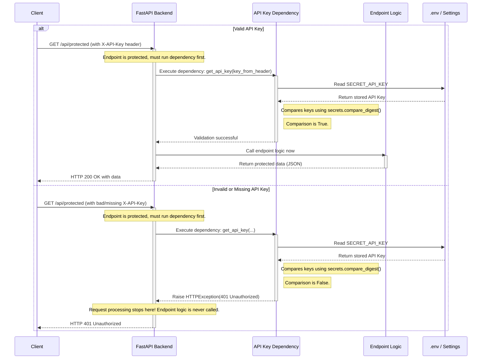
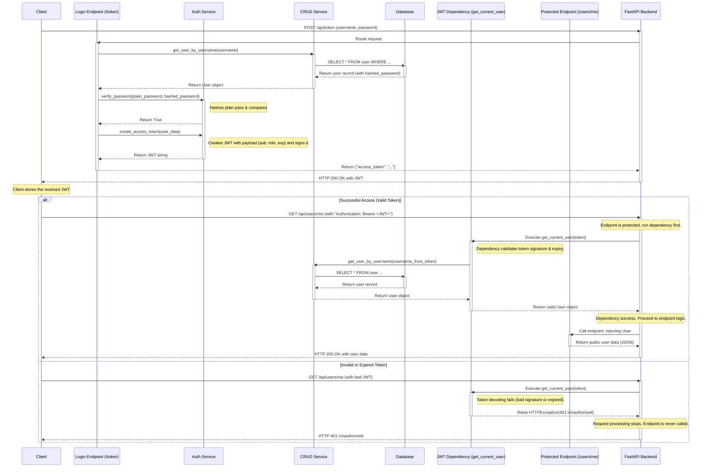
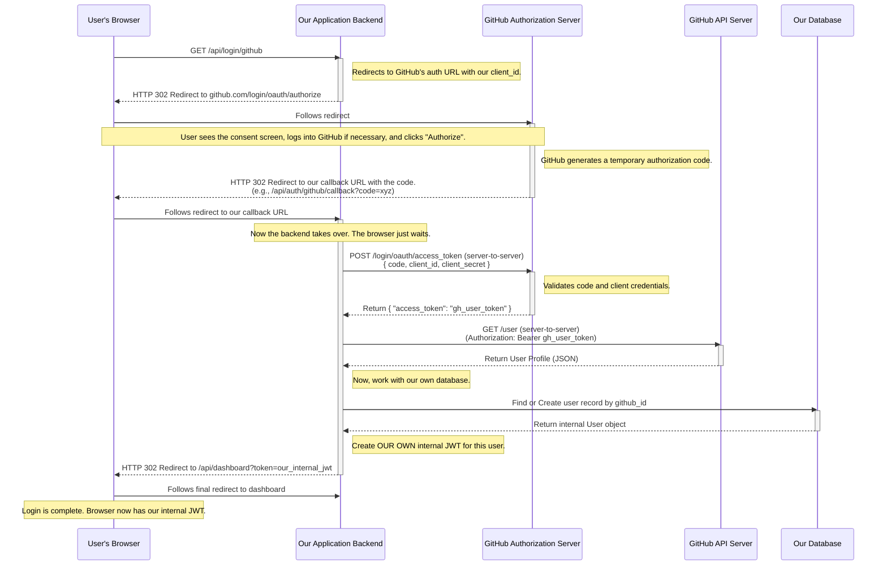

# Auth-Odyssey

> A Python/FastAPI project demonstrating key authentication patterns: API Keys, JWT (with refresh tokens & RBAC), and OAuth 2.0.

This project is a hands-on guide to implementing modern authentication and authorization. It was built step-by-step to demonstrate different security schemes, from simple API Keys to a complete OAuth 2.0 flow, all backed by a persistent database and a modular application structure.

## ✨ Features

-   **API Key Authentication**: Secure service-to-service endpoints with a simple, validated API key.
-   **JWT-Based Authentication**: Full username/password login flow using signed JSON Web Tokens.
-   **Secure Password Storage**: Uses `passlib` with `bcrypt` for industry-standard password hashing.
-   **Refresh Tokens**: Long-lived refresh tokens allow clients to get new access tokens without forcing users to re-authenticate, featuring token rotation for enhanced security.
-   **Role-Based Access Control (RBAC)**: Protects certain endpoints by requiring specific user roles (e.g., "admin") embedded in the JWT.
-   **OAuth 2.0 Integration**: Allows users to register and log in via a third-party provider (GitHub).
-   **Persistent Database**: Uses **SQLModel** (Pydantic + SQLAlchemy) with a SQLite backend to store user data.
-   **Modular Project Structure**: The code is organized into routers, services, and models for better scalability and maintainability.
-   **Minimalist Frontend Client**: A vanilla JavaScript single-page application demonstrates how to interact with the API, handle tokens, and make authenticated requests.

## 🚀 Getting Started

Follow these instructions to get the project running on your local machine.

### Prerequisites

-   Python 3.12+
-   A GitHub account (to create an OAuth application for testing the OAuth 2.0 flow)

### Installation & Setup

1.  **Clone the repository:**
    ```bash
    git clone https://github.com/your-username/auth-odyssey.git
    cd auth-odyssey
    ```

2.  **Create and activate a virtual environment:**
    ```bash
    python3 -m venv venv
    source venv/bin/activate
    # On Windows, use: venv\Scripts\activate
    ```

3.  **Install dependencies:**
    ```bash
    pip install -r requirements.txt
    ```

4.  **Set up your environment variables:**
    Create a `.env` file in the project root. You can copy the example below.
    ```env
    # .env

    # Used for simple X-API-Key authentication
    API_KEY="my-super-secret-api-key"

    # Used for signing short-lived JWT access tokens (generate with `openssl rand -hex 32`)
    JWT_SECRET_KEY="your_32_byte_hex_secret_for_jwt"

    # Used for signing long-lived JWT refresh tokens (generate with `openssl rand -hex 32`)
    JWT_REFRESH_SECRET_KEY="a_different_32_byte_hex_secret_for_refresh"
    REFRESH_TOKEN_EXPIRE_DAYS=7

    # Get these from your GitHub OAuth App settings
    GITHUB_CLIENT_ID="your_github_client_id"
    GITHUB_CLIENT_SECRET="your_github_client_secret"
    ```
    *To get GitHub credentials, create a new OAuth App [here](https://github.com/settings/developers). Set the "Authorization callback URL" to `http://127.0.0.1:8000/api/auth/github/callback`.*

5.  **Run the application:**
    The application is now managed within the `app` directory. Use the following command:
    ```bash
    uvicorn app.main:app --reload
    ```

6.  **Access the client:**
    Open your web browser and navigate to **http://127.0.0.1:8000/**. You will see the frontend client, where you can test all the features.

## 🛠️ API Endpoints

The frontend client at the root URL (`/`) interacts with the following API endpoints, all prefixed with `/api`.

| Endpoint                    | Method | Authentication      | Description                                          |
| --------------------------- | ------ | ------------------- | ---------------------------------------------------- |
| `/users`                    | `POST` | None                | Register a new user with a username and password.    |
| `/token`                    | `POST` | None (Form Data)    | Log in to get an access and refresh token pair.      |
| `/token/refresh`            | `POST` | Bearer (Refresh)    | Exchange a valid refresh token for a new token pair. |
| `/users/me`                 | `GET`  | Bearer (Access)     | Get the profile of the currently authenticated user. |
| `/login/github`             | `GET`  | None                | Redirects to GitHub to start the OAuth 2.0 flow.   |
| `/auth/github/callback`     | `GET`  | None                | Callback URL for GitHub to complete the OAuth flow.  |
| `/protected`                | `GET`  | API Key             | A sample endpoint protected by a static API key.     |
| `/admin/users`              | `GET`  | Bearer (Admin Role) | Get a list of all users in the database.             |
| `/admin/promote/{username}` | `POST` | Bearer (Admin Role) | Promote a user to the 'admin' role.                  |

---

## Design Diagrams

### Class Diagram



### API Key Sequence Diagram



### JWT Sequence Diagram



### OAuth Sequence Diagram


