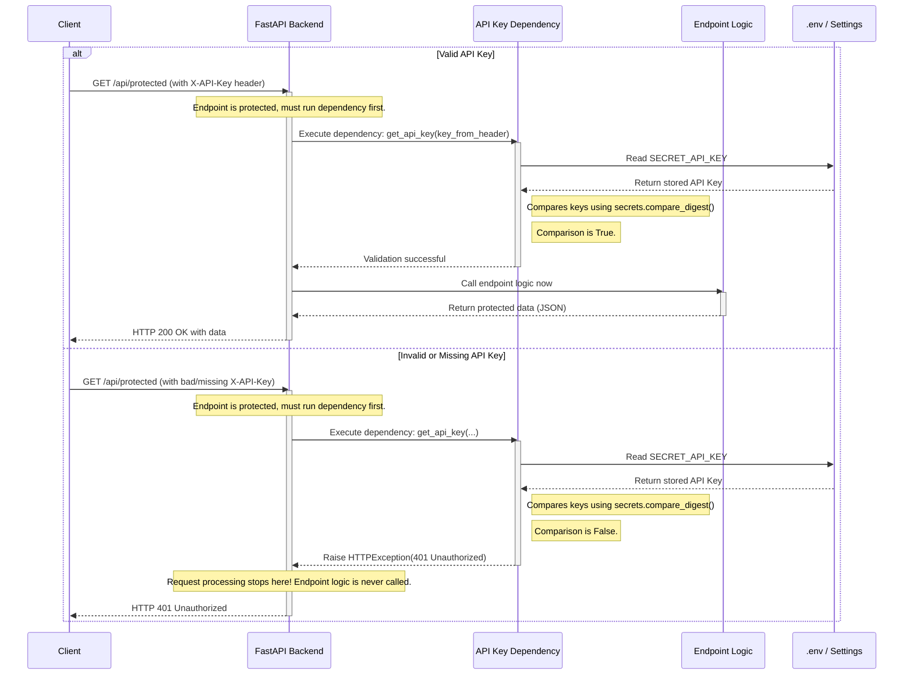

```mermaid
sequenceDiagram
    participant Client
    participant FastAPI_Backend as FastAPI Backend
    participant get_api_key as API Key Dependency
    participant read_protected_data as Endpoint Logic
    participant Settings as .env / Settings

    alt Valid API Key
        Client->>FastAPI_Backend: GET /api/protected (with X-API-Key header)

        activate FastAPI_Backend
        Note over FastAPI_Backend: Endpoint is protected, must run dependency first.
        FastAPI_Backend->>get_api_key: Execute dependency: get_api_key(key_from_header)
        
        activate get_api_key
        get_api_key->>Settings: Read SECRET_API_KEY
        Settings-->>get_api_key: Return stored API Key
        
        note right of get_api_key: Compares keys using secrets.compare_digest()
        note right of get_api_key: Comparison is True.
        
        get_api_key-->>FastAPI_Backend: Validation successful
        deactivate get_api_key

        FastAPI_Backend->>read_protected_data: Call endpoint logic now
        activate read_protected_data
        read_protected_data-->>FastAPI_Backend: Return protected data (JSON)
        deactivate read_protected_data
        
        FastAPI_Backend-->>Client: HTTP 200 OK with data
        deactivate FastAPI_Backend

    else Invalid or Missing API Key
        Client->>FastAPI_Backend: GET /api/protected (with bad/missing X-API-Key)
        
        activate FastAPI_Backend
        Note over FastAPI_Backend: Endpoint is protected, must run dependency first.
        FastAPI_Backend->>get_api_key: Execute dependency: get_api_key(...)

        activate get_api_key
        get_api_key->>Settings: Read SECRET_API_KEY
        Settings-->>get_api_key: Return stored API Key
        
        note right of get_api_key: Compares keys using secrets.compare_digest()
        note right of get_api_key: Comparison is False.
        
        get_api_key-->>FastAPI_Backend: Raise HTTPException(401 Unauthorized)
        deactivate get_api_key
        
        note over FastAPI_Backend: Request processing stops here! Endpoint logic is never called.
        
        FastAPI_Backend-->>Client: HTTP 401 Unauthorized
        deactivate FastAPI_Backend
    end
```
