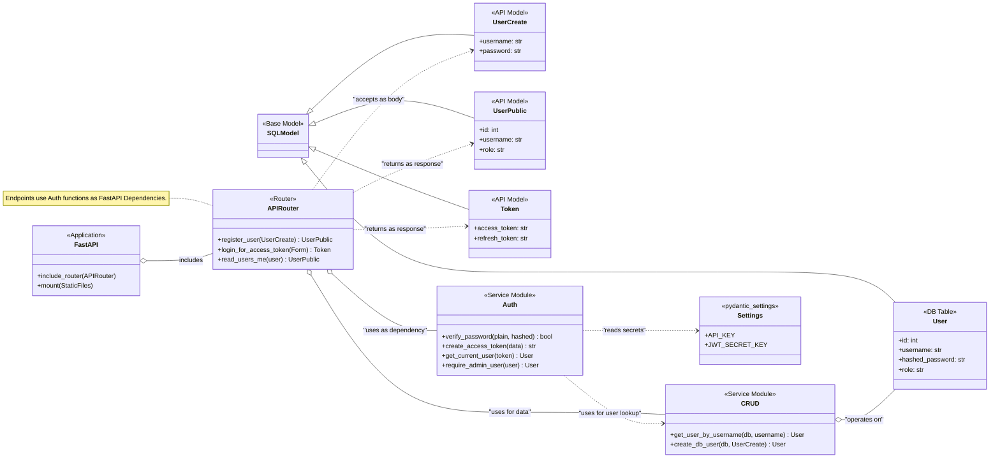

```mermaid
classDiagram
    direction LR

    %% --- Core Application ---
    class FastAPI {
        <<Application>>
        +include_router(APIRouter)
        +mount(StaticFiles)
    }
    class APIRouter {
        <<Router>>
        +register_user(UserCreate) UserPublic
        +login_for_access_token(Form) Token
        +read_users_me(user) UserPublic
    }

    %% --- Data & DB Models ---
    class SQLModel {
        <<Base Model>>
    }
    class User {
        <<DB Table>>
        +id: int
        +username: str
        +hashed_password: str
        +role: str
    }
    class UserCreate {
        <<API Model>>
        +username: str
        +password: str
    }
    class UserPublic {
        <<API Model>>
        +id: int
        +username: str
        +role: str
    }
    class Token {
        <<API Model>>
        +access_token: str
        +refresh_token: str
    }

    %% --- Services & Logic ---
    class Auth {
        <<Service Module>>
        +verify_password(plain, hashed) bool
        +create_access_token(data) str
        +get_current_user(token) User
        +require_admin_user(user) User
    }
    class CRUD {
        <<Service Module>>
        +get_user_by_username(db, username) User
        +create_db_user(db, UserCreate) User
    }

    %% --- Configuration ---
    class Settings {
        <<pydantic_settings>>
        +API_KEY
        +JWT_SECRET_KEY
    }

    %% --- Relationships ---
    FastAPI o-- APIRouter : includes
    
    SQLModel <|-- User
    SQLModel <|-- UserCreate
    SQLModel <|-- UserPublic
    SQLModel <|-- Token
    
    APIRouter o-- Auth : "uses as dependency"
    APIRouter o-- CRUD : "uses for data"
    
    Auth ..> CRUD : "uses for user lookup"
    Auth ..> Settings : "reads secrets"
    
    CRUD o-- User : "operates on"
    
    APIRouter ..> UserCreate : "accepts as body"
    APIRouter ..> UserPublic : "returns as response"
    APIRouter ..> Token : "returns as response"

    note for APIRouter "Endpoints use Auth functions as FastAPI Dependencies."
```
