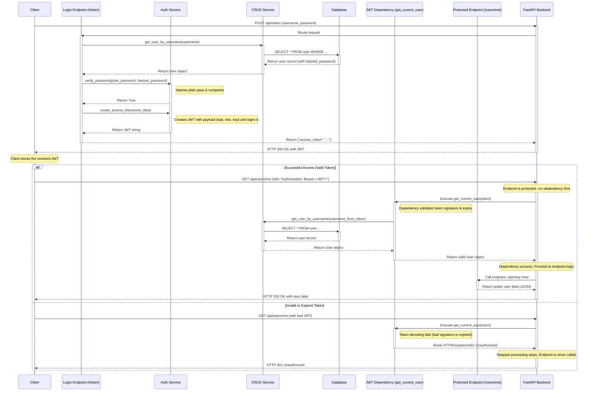

```mermaid
sequenceDiagram
    participant Client
    participant Login_Endpoint as Login Endpoint (/token)
    participant Auth_Service as Auth Service
    participant CRUD_Service as CRUD Service
    participant Database
    participant JWT_Dependency as JWT Dependency (get_current_user)
    participant Protected_Endpoint as Protected Endpoint (/users/me)
    participant FastAPI_Backend as FastAPI Backend

    %% === Phase 1: User logs in to get a token ===

    Client->>FastAPI_Backend: POST /api/token (username, password)
    activate FastAPI_Backend
    FastAPI_Backend->>Login_Endpoint: Route request
    
    activate Login_Endpoint
    Login_Endpoint->>CRUD_Service: get_user_by_username(username)
    activate CRUD_Service
    CRUD_Service->>Database: SELECT * FROM user WHERE ...
    activate Database
    Database-->>CRUD_Service: Return user record (with hashed_password)
    deactivate Database
    CRUD_Service-->>Login_Endpoint: Return User object
    deactivate CRUD_Service
    
    Login_Endpoint->>Auth_Service: verify_password(plain_password, hashed_password)
    activate Auth_Service
    Note right of Auth_Service: Hashes plain pass & compares
    Auth_Service-->>Login_Endpoint: Return True
    
    Login_Endpoint->>Auth_Service: create_access_token(user_data)
    Note right of Auth_Service: Creates JWT with payload (sub, role, exp) and signs it.
    Auth_Service-->>Login_Endpoint: Return JWT string
    deactivate Auth_Service
    
    Login_Endpoint-->>FastAPI_Backend: Return {"access_token": "..."}
    deactivate Login_Endpoint
    FastAPI_Backend-->>Client: HTTP 200 OK with JWT
    deactivate FastAPI_Backend

    Note over Client: Client stores the received JWT

    %% === Phase 2: Client uses the JWT to access a protected resource ===
    
    alt Successful Access (Valid Token)
        Client->>FastAPI_Backend: GET /api/users/me (with "Authorization: Bearer <JWT>")
        activate FastAPI_Backend
        
        Note over FastAPI_Backend: Endpoint is protected, run dependency first.
        FastAPI_Backend->>JWT_Dependency: Execute get_current_user(token)
        activate JWT_Dependency
        
        Note right of JWT_Dependency: Dependency validates token signature & expiry.
        JWT_Dependency->>CRUD_Service: get_user_by_username(username_from_token)
        activate CRUD_Service
        CRUD_Service->>Database: SELECT * FROM user ...
        activate Database
        Database-->>CRUD_Service: Return user record
        deactivate Database
        CRUD_Service-->>JWT_Dependency: Return User object
        deactivate CRUD_Service
        
        JWT_Dependency-->>FastAPI_Backend: Return valid User object
        deactivate JWT_Dependency
        
        Note over FastAPI_Backend: Dependency success. Proceed to endpoint logic.
        FastAPI_Backend->>Protected_Endpoint: Call endpoint, injecting User
        activate Protected_Endpoint
        Protected_Endpoint-->>FastAPI_Backend: Return public user data (JSON)
        deactivate Protected_Endpoint
        
        FastAPI_Backend-->>Client: HTTP 200 OK with user data
        deactivate FastAPI_Backend

    else Invalid or Expired Token
        Client->>FastAPI_Backend: GET /api/users/me (with bad JWT)
        activate FastAPI_Backend

        FastAPI_Backend->>JWT_Dependency: Execute get_current_user(token)
        activate JWT_Dependency
        Note right of JWT_Dependency: Token decoding fails (bad signature or expired).
        JWT_Dependency-->>FastAPI_Backend: Raise HTTPException(401 Unauthorized)
        deactivate JWT_Dependency
        
        Note over FastAPI_Backend: Request processing stops. Endpoint is never called.
        FastAPI_Backend-->>Client: HTTP 401 Unauthorized
        deactivate FastAPI_Backend
    end
```
