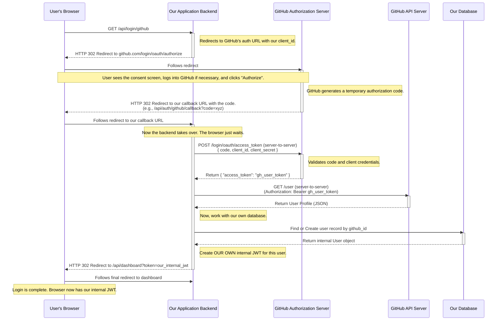

```mermaid
sequenceDiagram
    participant User's Browser
    participant Our Application Backend
    participant GitHub Authorization Server
    participant GitHub API Server
    participant Our Database

    %% === Phase 1: User initiates login and is redirected ===

    User's Browser->>Our Application Backend: GET /api/login/github
    activate Our Application Backend
    note right of Our Application Backend: Redirects to GitHub's auth URL with our client_id.
    Our Application Backend-->>User's Browser: HTTP 302 Redirect to github.com/login/oauth/authorize
    deactivate Our Application Backend

    %% === Phase 2: User authorizes the application on GitHub ===

    User's Browser->>GitHub Authorization Server: Follows redirect
    activate GitHub Authorization Server
    note over User's Browser, GitHub Authorization Server: User sees the consent screen, logs into GitHub if necessary, and clicks "Authorize".
    note right of GitHub Authorization Server: GitHub generates a temporary authorization code.
    GitHub Authorization Server-->>User's Browser: HTTP 302 Redirect to our callback URL with the code.<br/>(e.g., /api/auth/github/callback?code=xyz)
    deactivate GitHub Authorization Server

    %% === Phase 3: Backend exchanges the code for an access token ===

    User's Browser->>Our Application Backend: Follows redirect to our callback URL
    activate Our Application Backend
    note over Our Application Backend: Now the backend takes over. The browser just waits.
    Our Application Backend->>GitHub Authorization Server: POST /login/oauth/access_token (server-to-server)<br/>{ code, client_id, client_secret }
    activate GitHub Authorization Server
    note right of GitHub Authorization Server: Validates code and client credentials.
    GitHub Authorization Server-->>Our Application Backend: Return { "access_token": "gh_user_token" }
    deactivate GitHub Authorization Server

    %% === Phase 4: Backend fetches user info and creates internal session ===

    Our Application Backend->>GitHub API Server: GET /user (server-to-server)<br/>(Authorization: Bearer gh_user_token)
    activate GitHub API Server
    GitHub API Server-->>Our Application Backend: Return User Profile (JSON)
    deactivate GitHub API Server

    note right of Our Application Backend: Now, work with our own database.
    Our Application Backend->>Our Database: Find or Create user record by github_id
    activate Our Database
    Our Database-->>Our Application Backend: Return internal User object
    deactivate Our Database

    note right of Our Application Backend: Create OUR OWN internal JWT for this user.
    
    Our Application Backend-->>User's Browser: HTTP 302 Redirect to /api/dashboard?token=our_internal_jwt
    deactivate Our Application Backend
    
    User's Browser->>Our Application Backend: Follows final redirect to dashboard
    Note over User's Browser: Login is complete. Browser now has our internal JWT.
```
